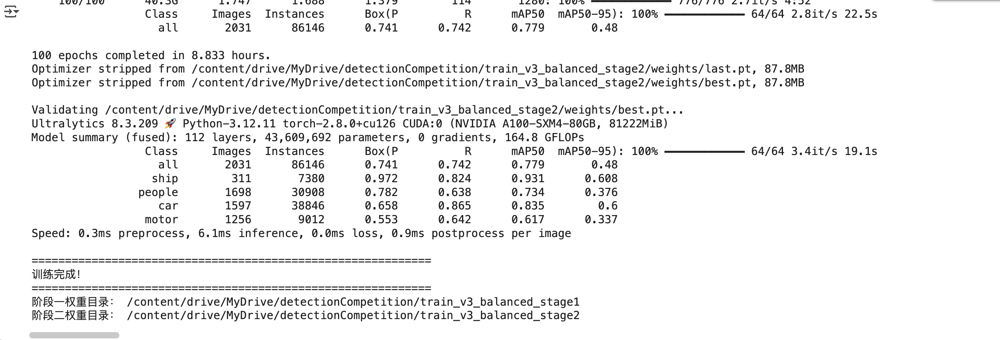
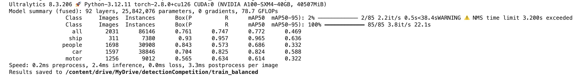

# Low-Altitude Multi-Object Detection with YOLO

This repository contains a YOLO-based object detection experiment for the CMCC Cup Zhejiang University Student Artificial Intelligence Competition. The project focuses on multi-object detection from low-altitude aerial images, where objects are dense, small, and often captured from tilted viewpoints.

## Project Overview

The competition task is to detect objects in low-altitude scenes such as city patrol, coastal monitoring, and port logistics. The notebook implements a full training workflow:

- Mounting Google Drive in Colab
- Loading COCO-format annotation files
- Exploring object category distributions
- Merging multiple detection datasets
- Mapping categories into the target label set
- Converting COCO annotations into YOLO label format
- Creating a YOLO `data.yml` configuration file
- Training and validating an Ultralytics YOLO model

## Competition Context

- Competition: China Mobile Cup, 1st Zhejiang University Student AI Competition
- Track: Low-altitude multi-object detection algorithm design and implementation
- Scenario: UAV and low-altitude image object detection
- Main challenge: small objects, dense targets, scale changes, and complex viewing angles

## Target Classes

The training configuration uses four classes:

| Class | Description |
| --- | --- |
| `car` | Cars and related vehicle objects |
| `people` | Pedestrians and people |
| `motor` | Motorcycles, bicycles, tricycles, and similar objects |
| `ship` | Ship objects |

## Dataset Summary

The local competition materials include:

| Split / File | Images | Annotations | Classes |
| --- | ---: | ---: | ---: |
| Training set | 4,739 | 202,467 | 4 |
| Validation set | 2,031 | 86,146 | 4 |
| Test set sample | 439 | - | 4 |
| Submission file | 439 | 119,974 | 4 |

Large datasets and submission JSON files are not committed to this repository.

## Training Results

The best recorded validation result reached approximately:

| Metric | Value |
| --- | ---: |
| Precision | 0.741 |
| Recall | 0.742 |
| mAP50 | 0.779 |
| mAP50-95 | 0.480 |

Per-class validation summary:

| Class | Precision | Recall | mAP50 | mAP50-95 |
| --- | ---: | ---: | ---: | ---: |
| ship | 0.972 | 0.824 | 0.931 | 0.608 |
| people | 0.782 | 0.638 | 0.734 | 0.376 |
| car | 0.658 | 0.865 | 0.835 | 0.600 |
| motor | 0.553 | 0.642 | 0.617 | 0.337 |

Additional validation summary:

## Tech Stack

- Python
- Google Colab
- Jupyter Notebook
- Ultralytics YOLO
- COCO annotation format
- Pandas, NumPy, Matplotlib, Seaborn

## Files

| File | Description |
| --- | --- |
| `main.ipynb` | Main Colab notebook for dataset analysis, conversion, and YOLO training |
| `README.md` | Project documentation |
| `assets/` | Training result screenshots used in the documentation |

## How to Use

1. Open `main.ipynb` in Google Colab.
2. Mount Google Drive.
3. Place the dataset and COCO annotation files in the paths expected by the notebook.
4. Install the required packages in Colab.
5. Run the data analysis, conversion, and training cells in order.

## Notes

- Dataset files and trained model weights are not included in this repository.
- API keys should be stored privately and should not be committed to GitHub.
- The notebook uses a placeholder for Roboflow access: `YOUR_ROBOFLOW_API_KEY`.
